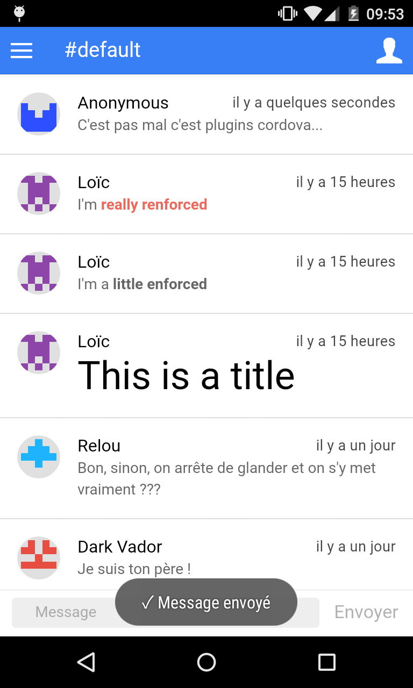

# Faire un chat avec Ionic & Firebase
##### Par [Loïc Delmaire](https://twitter.com/loicdelmaire) & [Loïc Knuchel](http://loic.knuchel.org/)

**Prérequis** : Les participants doivent connaître un minimum de JavaScript et d'Angular pour pouvoir faire cet atelier dans les meilleures conditions.

### L'application à développer

L'objectif de ce [Hands on Lab](http://cfp.devoxx.fr/2015/talk/JDN-0259/3h_pour_creer_votre_application_mobile_de_chat)
est de faire coder aux participants une application mobile de chat en utilisant [Ionic Framework](http://ionicframework.com/)
(Cordova et Angular) et [Firebase](https://www.firebase.com/) comme backend.

Les premières étapes sont la mise en place d'un MVP fonctionnel puis l'enrichissement progressif
de celui-ci avec différentes fonctionnalités :

* Changement de pseudo
* Multi-channels
* Support des avatars
* Support du markdown
* Changement de l'icône de l'application

### Informations

Ressources utiles :

* [Ionic Framework docs](http://ionicframework.com/docs/)
* [Ionicons](http://ionicons.com/)
* [Angular CheatScheet](https://github.com/loicknuchel/devoxx-2015-ionic-chat/blob/master/help-angular.md) (dédiée à ce Hands on !)
* [Angular API](https://docs.angularjs.org/api)
* [Firebase docs](https://www.firebase.com/docs/web/)


### Installation

Les participants doivent avoir installé leur environnement au préalable et exécuté le template de base de ce repo (branche master).

Pour cela, le mieux est de suivre le [Getting Started](http://ionicframework.com/getting-started/) de Ionic framework puis cloner ce repo (`git clone https://github.com/loicknuchel/devoxx-2015-ionic-chat.git`) et lancer les commandes suivantes :

- `npm install` : Installation des dépendances liées à nodejs
- `bower install` : Installation des dépendances liées au front
- `cordova platform add <android|ios>` : Ajout de la plateforme souhaitée au projet
- `ionic run <android|ios>` : Lancement de l'application sur un device connecté à l'ordinateur

### Structure d'une application Ionic

```
devoxx-ionic-chat
|-- hooks/            # les hooks Ionic dans le cycle de build cordova
|-- platforms/        # les fichiers générés pour chaque plateforme du projet
|-- plugins/          # contient tous les plugins ajoutés au projet
|-- resources/        # images de l'application : icon.png (512x512), le splash.png (2208x2208) et les images générées par plateforme
|-- scss/             # contient les fichiers scss de l'application lorsque l'application est configurée pour (ionic setup sass)
|-- www/              # contient le code de l'application :)
|    |-- css/
|    |    +-- style.css
|    |-- img/
|    |-- js/
|    |    |-- app.js
|    |    |-- controllers.js
|    |    +-- services.js
|    |-- lib/         # contient les librairies gérées par bower
|    |-- views/
|    |    +-- app.html
|    +-- index.html
|-- bower.json        # dépendences de l'application
|-- config.xml        # configuration cordova de l'application
|-- gulpfile.js       # tâche de build Ionic
|-- ionic.project     # configuration Ionic du projet
+-- package.json      # dépendences nodejs du projet
```

Du coup, si tu as bien suivi, on ne s'occupera pas des fichiers dans `www/` pour créer notre application :)

### Étape 0 : mise en place de la structure de l'application

Si tu as cloné ce repo, passe directement à l'étape 1. Si tu souhaites réellement partir de 0, cette étape te permettra d'arriver au point de départ de ce repo.

- crée un projet ionic vide (`ionic start devoxx-ionic-chat blank`)
- ajoute ta plateforme et lance l'application sur ton téléphone (`ionic platform add <android|ios> && ionic run`)
- si l'application se lance, bravo !!! Tout fonctionne bien ! Sinon... :( Tu peux reprendre le [Getting Started](http://ionicframework.com/getting-started/) ou poser une question sur le [forum Ionic](http://forum.ionicframework.com/)
- ajoute `www/lib/`, `resources/android/` et `resources/ios/` dans le `.gitignore`
- renomme l'application angular de 'starter' en 'app'
- crée les fichiers de contrôleurs et services et inclue-les dans l'*index.html*
- remplace le contenu du body par un unique [nav view](http://ionicframework.com/docs/api/directive/ionNavView/)
- crée une [première route](http://ionicframework.com/docs/api/directive/ionNavView/#usage), app, avec son contrôleur et sa vue. La vue comportera simplement une barre de navigation avec un titre et un contenu vierge.
- lance ton application dans le navigateur et sur ton téléphone :) (`ionic serve` et `ionic run`)

Voici le résultat que tu devrais obtenir : 

### Étape 1 : Création de l'interface minimale

**Objectif**

Implémenter les éléments graphiques :

* la liste des messages avec l'avatar et le nom du créateur
* un champ de texte pour envoyer un nouveau message

**Ressources**

*Pour les messages*, ionic fournit des composants CSS permettant d'afficher des listes avec des avatars : [Item Avatars](http://ionicframework.com/docs/components/#item-avatars)

Voici un jeu de messages test à ajouter dans le contrôleur:

```javascript
[
    {user: {avatar: 'http://ionicframework.com/img/docs/venkman.jpg', name: 'Venkman'}, content: 'Back off, man. I\'m a scientist.'},
    {user: {avatar: 'http://ionicframework.com/img/docs/spengler.jpg', name: 'Egon'}, content: 'We\'re gonna go full stream.'},
    {user: {avatar: 'http://ionicframework.com/img/docs/stantz.jpg', name: 'Ray'}, content: 'Ugly little spud, isn\'t he?'},
    {user: {avatar: 'http://ionicframework.com/img/docs/winston.jpg', name: 'Winston'}, content: 'That\'s a big Twinkie.'},
    {user: {avatar: 'http://ionicframework.com/img/docs/tully.jpg', name: 'Tully'}, content: 'Okay, who brought the dog?'},
    {user: {avatar: 'http://ionicframework.com/img/docs/barrett.jpg', name: 'Dana'}, content: 'I am The Gatekeeper!'},
    {user: {avatar: 'http://ionicframework.com/img/docs/slimer.jpg', name: 'Slimer'}, content: 'Boo!'}
]
```

*Pour le champ de texte*, on le mettra dans un footer, et encore une fois ionic fournit des composants pour divers types de footer : [Footer](http://ionicframework.com/docs/components/#footer) et [Bar input](http://ionicframework.com/docs/components/#bar-inputs).

On voudra aussi publier des messages. Pour cela, il faut implémenter une fonction `sendMessage(message)` dans le contrôleur. Cette fonction doit ajouter le message en début de liste avec un 'user' défini en dur pour le moment.

Et voilà ! Si tout s'est bien passé tu devrais avoir quelque chose comme ça : 

[Lien vers la correction](https://gist.github.com/skelz0r/52004bdc808c411086f1)

Si tu es perdu, tu peux faire un `git checkout step1`

### Étape 2 : le backend

Bon, c'est encore très rudimentaire (tout le monde s'appelle pareil, pas de date sur les messages...) mais nous verrons tout ça plus tard... Mais le pire c'est que nos messages restent sur le téléphone, pas encore moyen de communiquer...

Réglons ce problème et attaquons-nous maintenant au backend.

Dans le cadre de cet atelier, nous allons utiliser [Firebase](https://www.firebase.com/) comme base de données (à noter que [Parse](https://parse.com/)+[Pusher](https://pusher.com/) ou un backend custom ferait tout aussi bien l'affaire !).

Firebase est un *Backend as a Service*, c'est une sorte de base de données hébergée et accessible via une API. Le gros avantage c'est que si on n'a pas de fonctionnalité 'spéciale' on peut s'affranchir complètement du développement et de l'hébergement du serveur et se concentrer sur le front, le mobile, le design et l'UX !!! Et c'est plutôt cool :D

Tout d'abord, il faut créer une application sur Firebase. Au choix, tu peux soit [créer ta propre application](https://www.firebase.com/) (5 min) soit utiliser l'application que j'ai créée pour l'atelier : `https://chat-devoxx-2015.firebaseio.com/`. Si tu utilises l'application de l'atelier, pense à ajouter un namespace pour ne pas avoir de collisions avec les autres (ex: https://chat-devoxx-2015.firebaseio.com/myname/).

**Installation**

Nous allons utiliser la librairie de Firebase spéciale pour Angular :

1. Télécharger les librairies (firebase et angularfire) : `bower install firebase angularfire --save` (merci bower !)
2. Les inclure dans le *index.html* :
   ```
   <script src="lib/firebase/firebase.js"></script>
   <script src="lib/angularfire/dist/angularfire.js"></script>
   ```
3. Ajouter 'firebase' en dépendance de notre application angular `angular.module('app', ['ionic', 'firebase'])` (*app.js*)

**Objectif**

Implémenter un service `RoomSrv` qui aura deux méthodes:

* `getMessage()` qui retournera la liste des messages dans firebase
* `sendMessage(message, messages)` avec `message` le nouveau message et `messages` la liste des messages

Ce service s'interfaçera bien entendu avec Firebase. On utilisera des [FirebaseArray](https://www.firebase.com/docs/web/libraries/angular/api.html#angularfire-firebasearray)

L'URL devra être namespacé avec votre nom et le 'default' : `https://chat-devoxx-2015.firebaseio.com/name/default/` (en prévision de la suite).

Ajouter une constante `Config` dans `app.js` dans laquelle stocker l'URL firebase et que tu pourra injecter dans les services en ayant besoin.

Et enfin, remplacer les méthodes du contrôleur par celles du `RoomSrv`.

[Lien vers la correction](https://gist.github.com/skelz0r/2cdbfccc02445948987e)

Si tu es perdu, tu peux faire un `git checkout step2`

### Étape 3 : Personnaliser l'utilisateur

Le chat est fonctionnel, mais il est impossible de savoir qui a posté quoi :(

Il est temps de changer ça en permettant de changer son nom et son avatar.

**Objectif**

On va permettre de personnaliser l'utilisateur en:

* ajoutant de quoi modifier le nom
* générant un avatar en fonction du nom

Pour cela, il faut implémenter un service `User` qui aura deux méthodes :

* `get()` qui retournera l'utilisateur
* `changeName()` qui fera apparaître une popup ionic, et qui permettra de changer le nom de l'utilisateur

Les changements seront stockés en local à l'aide de `window.localStorage`, tu trouveras une implémentation d'un service ici : [Storage](https://gist.github.com/skelz0r/7110873b8173dc354303)

Pour l'avatar, on utilisera [identicon](https://github.com/cupcake/sigil)

**Ressources**

* [Popup Ionic](http://ionicframework.com/docs/api/service/$ionicPopup/)
* [Exemple d'avatar avec le nom 'ionic'](https://sigil.cupcake.io/ionic)

Voici à quoi cela devrait ressembler : 

### Étape 4 : Ajouter et afficher les dates des messages

Les personnes attentives auront remarqué qu'on n'enregistrait pas les dates des messages et qu'il y a donc un risque qu'ils soient mal ordonnés. Par ailleurs, il peut être sympa de voir quand les messages précédents ont été postés.

**Objectif**

- Ajouter un attribut `sendDate` aux messages pour stocker la date d'envoi
- Afficher la date de manière friendly (cf [momentjs](http://momentjs.com/) et[angular-moment](https://github.com/urish/angular-moment))
- Trier les messages par date décroissante (cf [filtres angular](https://docs.angularjs.org/api/ng/filter/orderBy))

**Installation**

Pour installer angular-moment il suffit de :

- télécharger la librairie : `bower install angular-moment --save` (bower se charge de la dépendence sur moment)
- les ajouter dans le *index.html* :
    ```
    <script src="lib/moment/min/moment.min.js"></script>
    <script src="lib/moment/locale/fr.js"></script>
    <script src="lib/angular-moment/angular-moment.js"></script>
    ```
- ajouter le module 'angularMoment' en dépendance de ton application angular (*app.js*)

Voilà le résultat : 

Tant qu'on est sur les petites améliorations, tu as peut être remarqué que les messages sont tronqués à la fin de la première ligne. Aller, un petit coup de CSS pour régler ça ;)

### Étape 5 : Et si on supprimait des messages ?

Bonne idée ? Mauvaise idée ? En tous cas, on y va !!!

Ta tâche, si tu l'acceptes, sera maintenant de supprimer un message lorsque l'utilisateur fait un appui long dessus. Pour que ce ne soit pas inattendu par l'utilisateur, un [ActionSheet](http://ionicframework.com/docs/api/service/$ionicActionSheet/) pourrait être le bienvenu :)

**Objectif**

- Dans le service `RoomSrv`, créer une fonction `deleteMessage(message, messages)` qui prend le message à supprimer et la collection de message et supprime le message en question ([aide](https://www.firebase.com/docs/web/libraries/angular/api.html#angularfire-firebasearray-removerecordorindex))
- Créer une fonction `messageActions(message)` dans le scope qui s'exécute lors d'un [appui long](http://ionicframework.com/docs/api/directive/onHold/) sur un message.
- La fonction `messageActions(message)` ouvre un [ActionSheet](http://ionicframework.com/docs/api/service/$ionicActionSheet/) avec un texte 'Message de Loïc' et deux boutons 'Supprimer' et 'Annuler'.
- Supprimer le message en question si on clique sur supprimer
- Dans tous les cas, ('Supprimer' ou 'Annuler'), referme l'ActionSheet


### Étape 6 : Préparation du multi-room : le side-menu

Parler tous ensemble c'est bien mais ce serait bien d'avoir des sujets précis et donc de gérer le multi-room. Dans le concept c'est très simple, au lieu de publier les messages dans `/myname/default/`, on va les publier dans `/myname/roomName/`. Cependant, cela va représenter pas mal de changements, notamment sur la partie interface. C'est pourquoi cette fonctionnalité est séparée en plusieurs étapes.

**Etapes**

- Créer un fichier `views/menu.html` qui contiendra le [SideMenu](http://ionicframework.com/docs/api/directive/ionSideMenus/). Mettre un [ion-nav-view](http://ionicframework.com/docs/api/directive/ionNavView/) dans la partie content pour pouvoir y inclure les templates nécessaires. Dans la partie menu, mettre simplement un [header](http://ionicframework.com/docs/api/directive/ionHeaderBar/) et un [content](http://ionicframework.com/docs/api/directive/ionContent/) avec un peu de texte.
- Dans *app.js*, créer un nouvel état 'app' ayant pour template le `menu.html` et un contrôleur `MenuCtrl`. Cet état doit être [abstrait](https://github.com/angular-ui/ui-router/wiki/Nested-States-%26-Nested-Views#abstract-states).
- Renommer ensuite l'ancien état 'app' en 'app.room' pour qu'il [dépende de l'état précédent](https://github.com/angular-ui/ui-router/wiki/Nested-States-%26-Nested-Views#methods-for-nesting-states).
- Changer le `otherwise` pour qu'il redirige vers */menu/app* au lieu de simplement */app*
- Ajouter un bouton à gauche pour pouvoir [ouvrir et fermer le SideMenu](http://ionicframework.com/docs/api/directive/menuToggle/).

Les opérations sont moins simples que d'habitude mais si tout se passe bien, le résultat devrait ressembler à ça :  et 

### Étape 7 : Préparation du multi-room : afficher et ajouter des rooms dans le side-menu

Maintenant que notre SideMenu fonctionne, on va s'en servir pour afficher les différentes rooms disponibles et permettre d'en créer de nouvelles.

Pour accéder aux rooms existantes, l'[API REST](https://www.firebase.com/docs/rest/api/#section-get) de firebase est idéale. Comme seulement les noms nous intéressent, utiliser l'attribut [shallow](https://www.firebase.com/docs/rest/api/#section-query-parameters).

**Objectif**

- Créer une fonction `getRooms()` dans `RoomSrv` qui renverra un tableau contenant la liste des rooms existantes
- Récupérer les rooms existante et les afficher dans une [liste](http://ionicframework.com/docs/components/#list) dans le SideMenu, cela se passe donc dans le `MenuCtrl` et le fichier *menu.html*
- Modifier l'état `app.room` (*app.js*) pour qu'il prenne le [nom de la room souhaitée en paramètre](https://github.com/angular-ui/ui-router/wiki/URL-Routing#url-parameters)
- Modifier le `AppCtrl` pour que les messages affichés soient ceux de la [room choisie](https://github.com/angular-ui/ui-router/wiki/URL-Routing#stateparams-service). 

Et voilà le résultat : 

Mais ce n'est pas fini, il faut maintenant pouvoir ajouter une nouvelle room.

**Objectif**

- Ajouter un [bouton dans le header](http://ionicframework.com/docs/components/#clear-buttons-headers)
- Créer une fonction `createRoom()` dans le `MenuCtrl` qui proposera une [Popup](http://ionicframework.com/docs/api/service/$ionicPopup/) permettant à l'utilisateur de donner le nom de la nouvelle room.
- Une fois le nom renseigné, [rediriger](https://github.com/angular-ui/ui-router/wiki/Quick-Reference#stategoto--toparams--options) l'utilisateur vers la room demandée

 et 

### Étape 8 : Markdown support

L'application commence à être sympa non ? Et si on y ajoutait des styles ? Genre du markdown ?

Ce qui est cool c'est qu'il y a toujours une lib Angular : [angular-markdown-directive](https://github.com/btford/angular-markdown-directive) :)

**Objectif**

- Installer la lirairie angular (bower install, index.html, app.js...)
- la mettre en place sur le contenu des messages

Et voilà : 

C'était simple non ?

### Étape 9 : Custom app icon

Sympa l'application non ? Faisons une petite pause dans les fonctionnalités pour s'occuper de ce qu'il y a "autour". Et notamment de l'icône et de l'image de lancement (splash screen). Ca tombe bien, Ionic nous [facilite grandement la tâche](http://ionicframework.com/docs/cli/icon-splashscreen.html) avec la CLI.

**Objectif**

- Trouver une icône (minimum 192x192) et un splash screen (2208x2208) pour ton application (voici [un](https://www.google.fr/search?q=chat+icon&tbm=isch) [peu](https://www.google.fr/search?q=chat+bubble+icon&tbm=isch) [d'](https://www.google.fr/search?q=discussion&tbm=isch)[inspiration](https://www.google.fr/search?q=forum&tbm=isch))
- les mettre dans le répertoire `resources`
- les générer à nouveau : `ionic resources`
- installer l'application sur ton téléphone (`ionic run`)

Pour ceux qui sont sous Android, ne vous inquiétez pas si le logo ne change pas... Android gère mal le changement de logo d'une application. Pour voir votre nouvelle icône, il suffit de désinstaller l'application et de la réinstaller.

### Étape 10 : Add native plugins (Toast, Dialog)

On a bien taffé mais au final, on ne fait pas grand chose de plus qu'une application web angular... Bon ok, on va maintenant ajouter quelques plugins pour rendre les choses plus sympas. Pour note, l'équipe de Ionic a lancé un projet bien sympa [ngCordova](http://ngcordova.com/) mais pour cette fois-ci, on va y aller à l'ancienne ;)

Voici les plugins qui peuvent être intéressants pour notre application :

- [actionSheet](https://github.com/EddyVerbruggen/cordova-plugin-actionsheet) : remplace l'actionSheet de Ionic par une native ([ngCordova](http://ngcordova.com/docs/plugins/actionSheet/))
- [camera](https://github.com/apache/cordova-plugin-camera) : pour publier des photos / changer son avatar ([ngCordova](http://ngcordova.com/docs/plugins/camera/))
- [geolocation](https://github.com/apache/cordova-plugin-geolocation) : pour envoyer des messages géolocalisés ([ngCordova](http://ngcordova.com/docs/plugins/geolocation/))
- [inAppBrowser](https://github.com/apache/cordova-plugin-inappbrowser) : pour ouvrir des liens ([ngCordova](http://ngcordova.com/docs/plugins/inAppBrowser/))
- [oauth](http://ngcordova.com/docs/plugins/oauth/) : pour que les utilisateurs s'enregistrent avec leur réseau social ([ngCordova](http://ngcordova.com/docs/plugins/oauth/))
- [socialSharing](https://github.com/EddyVerbruggen/SocialSharing-PhoneGap-Plugin) : pour partager du contenu ([ngCordova](http://ngcordova.com/docs/plugins/socialSharing/))
- [sqlite](https://github.com/brodysoft/Cordova-SQLitePlugin) : pour utiliser une base de données embarquée (aller + loin que le localStorage) ([ngCordova](http://ngcordova.com/docs/plugins/sqlite/))
- [toast](https://github.com/EddyVerbruggen/Toast-PhoneGap-Plugin) : pour afficher de petits messages d'information non intrusifs ([ngCordova](http://ngcordova.com/docs/plugins/toast/))

Pour commencer, le plus simple est de mettre en place le plugin `toast`. L'idéal est de créer un service spécial pour utiliser ce plugin de manière simple dans le reste du code.



### Fini !!!

Tu es arrivé jusque là ? Félicitations !!! Tu peux maintenant trouver toi-même des fonctionnalités/plugins à mettre en place, aider les autres à avancer ou tout simplement tester ta nouvelle application :D
