# Faire un chat avec Ionic & Firebase
##### Par [Loïc Delmaire](https://twitter.com/loicdelmaire) & [Loïc Knuchel](http://loic.knuchel.org/)

**Prérequis** : Les participants doivent connaitre un minimum de JavaScript et d'Angular pour pouvoir faire cet atelier dans les meilleures conditions

### L'application à développer

L'objectif de ce [Hands on Lab](http://cfp.devoxx.fr/2015/talk/JDN-0259/3h_pour_creer_votre_application_mobile_de_chat) est de faire coder aux participants une application mobile de chat en utilisant Ionic Framework (Cordova et Angular) et Firebase comme backend.

Les premières étapes sont la mise en place d'un MVP fonctionnel puis l'enrichissement progressif de celui-ci avec différentes fonctionnalités :

- changement de pseudo
- multi-room
- support des avatar
- support du markdown
- changer l'icone de l'application

### Informations

Ressources utiles :

- [Ionic Framework docs](http://ionicframework.com/docs/)
- [Angular API](https://docs.angularjs.org/api)

### Installation

Les participants doivent avoir installé leur environnement au préalable et exécuté le template de base de ce repo (branche master). Pour cela, le mieux est de suivre le [Getting Started](http://ionicframework.com/getting-started/) de Ionic framework puis cloner ce repo et lancer les commandes suivantes :

```
npm install
bower install
cordova platform add [android/ios]
ionic run
```

### Étape 0 : mise en place de la structure de l'application

Si tu as cloné ce repo, passe directement à l'étape 1. Si tu souhaites réellement partir de 0, cette étape te permettra d'arriver au point de départ de ce repo.

- crée un projet ionic vide (devoxx-ionic-chat)
- ajoute ta plateforme et lance l'application sur ton téléphone
- si l'application se lance, bravo !!! Tout fonctionne bien ! Sinon... :( Tu peux reprendre le [Getting Started](http://ionicframework.com/getting-started/) ou poser une question sur le [forum Ionic](http://forum.ionicframework.com/)
- ajoute `www/lib/`, `resources/android/` et `resources/ios/` dans le .gitignore
- renomme l'application angular de 'starter' en 'app'
- crée les fichiers de contrôleurs et services et inclu les dans l'index.html
- remplace le contenu du body par un unique nav view
- crée une première route, app, avec son contrôleur et sa vue. La vue comportera simplement une barre de navigation avec un titre et un contenu vierge.
- lance ton application dans le navigateur et sur ton téléphone :)

Voici le résultat que tu devrais obtenir : 

### Étape 1 : création de l'interface

Il y a deux éléments principaux dans une application de chat, la liste des messages et le champ de texte pour envoyer un nouveau message.

Commençons par la liste des messages. Tout d'abord, il va falloir prendre des données pour voir à quoi ressemblera cette liste. Voici quelques messages de test :
```javascript
[
    {user: {avatar: 'http://ionicframework.com/img/docs/venkman.jpg', name: 'Venkman'}, content: 'Back off, man. I\'m a scientist.'},
    {user: {avatar: 'http://ionicframework.com/img/docs/spengler.jpg', name: 'Egon'}, content: 'We\'re gonna go full stream.'},
    {user: {avatar: 'http://ionicframework.com/img/docs/stantz.jpg', name: 'Ray'}, content: 'Ugly little spud, isn\'t he?'},
    {user: {avatar: 'http://ionicframework.com/img/docs/winston.jpg', name: 'Winston'}, content: 'That\'s a big Twinkie.'},
    {user: {avatar: 'http://ionicframework.com/img/docs/tully.jpg', name: 'Tully'}, content: 'Okay, who brought the dog?'},
    {user: {avatar: 'http://ionicframework.com/img/docs/barrett.jpg', name: 'Dana'}, content: 'I am The Gatekeeper!'},
    {user: {avatar: 'http://ionicframework.com/img/docs/slimer.jpg', name: 'Slimer'}, content: 'Boo!'}
]
```

Tu as une super liste ? Bravo !

Maintenant nous allons pouvoir créer le champ de text pour envoyer un nouveau message et créer une fonction pour envoyer le message écrit (c'est à dire, l'ajouter à la liste des messages affichés).

Bon, ça commence à prendre forme ! Mais à y regarder d'un peu plus près, il y a quelques petits problèmes UX... Si tu veux les régler, c'est bonus !

- le message reste dans le champ de texte lorsqu'on l'envoi (il devrait disparaitre...)
- si on appuie sur Enter (sur le PC) ou sur Ok (sur le mobile), le message n'est pas envoyé

Et voilà ! Si tu s'est bien passé tu devrais avoir quelque chose comme : 

### Étape 2 : le backend

Bon, c'est encore très rudimentaire (tout le monde s'appelle pareil, pas de date sur les messages...) mais nous verrons tout ça plus tard... Mais le pire c'est que nos messages restent sur le téléphone, pas encore moyen de communiquer... Réglons ce problème et attaquons nous maintenant au backend.

Dans le cadre de cet atelier, nous allons utiliser [firebase](https://www.firebase.com/) comme base de données, mais [parse](https://parse.com/)+[pusher](https://pusher.com/) ou un backend custom ferait tout aussi bien l'affaire !

Firebase est un Backend as a Service, c'est une sorte de base de donnée hébergée et accessible via une API. Le gros avantage c'est que si on n'a pas de fonctionnalité 'spéciale' on peut s'affranchir complètement d'un serveur et ce concentrer sur le front, le mobile, le design et l'UX !!! Et c'est plutôt cool :D

Tout d'abord, il faut créer une application sur firebase. Tu peux soit créer ta propre application (5 min) soit utiliser l'application que j'ai créé pour l'atelier (https://chat-devoxx-2015.firebaseio.com/). Si tu utilises l'application de l'atelier, pense à ajouter un namespace pour ne pas avoir de collision avec les autres (ex: https://chat-devoxx-2015.firebaseio.com/myname/).

Ensuite, il faut installer la librairie firebase :

- télécharger la librairie : `bower install firebase --save` (merci bower !)
- l'inclure de la index.html : `<script src="lib/firebase/firebase.js"></script>`

Il y a aussi une librairie spéciale pour angular, si tu veux l'utiliser (pas obligé) il faut aussi :

- la télécharger : `bower install angularfire --save`
- l'inclure dans le index.html `<script src="lib/angularfire/dist/angularfire.js"></script>`
- et enfin, l'ajouter un dépendence de notre application angular `angular.module('app', ['ionic', 'firebase'])`

Ceci étant fait, il est temps d'aller voir la [documentation de firebase](https://www.firebase.com/docs/) !

Pour cette étape, le but sera de créer un service qui s'intervace avec firebase (en utilisant angularfire ou pas) et de le lier avec le contrôlleur de l'application.

### Étape 3 : personnaliser l'utilisateur

Le chat est fonctionnel mais tous les utilisateurs s'appelle pareil et ont le même avatar :( Il est temps de changer ça !!!

Commençons par son nom. Nous allons créer un service pour gérer les données de l'utilisateur (et les persister en local) et lui permettre de changer son nom. Pour cela, je te propose d'ajouter un bouton dans la barre de header et d'utiliser une [Popup Ionic](http://ionicframework.com/docs/api/service/$ionicPopup/).

Voici à quoi ça devrais ressembler : 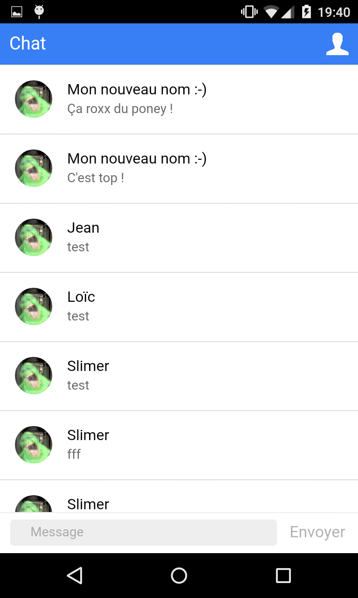 et 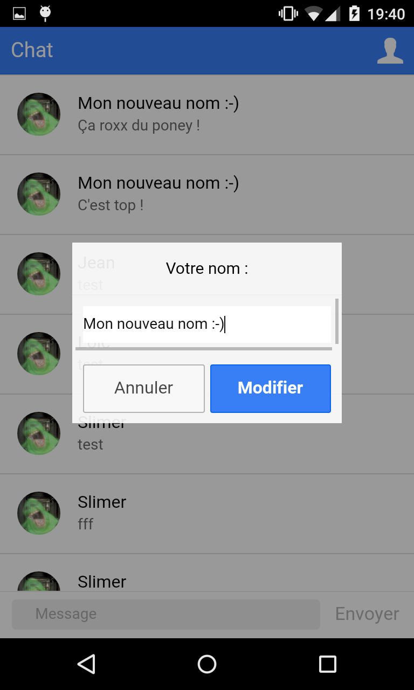

Il serait certainement un peu mieux que tous les utilisateurs n'aient pas le même avatar. Comme prendre une photo, la redimentionner, l'uploader sur un serveur et l'afficher en tant qu'avatar utilisateur est un peu complexe, je te propose d'utiliser des [identicon](https://github.com/cupcake/sigil).

C'est quand même bien mieux comme ça : 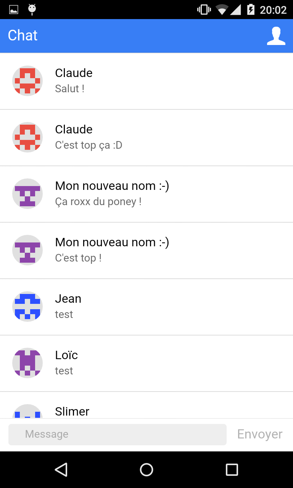

### Étape 4 : Ajouter et afficher les dates des messages

Les personnes attentives auront remarqué qu'on n'enregistrait pas les dates des messages et qu'il y a donc un risque qu'ils soient mal ordonnés. Par ailleurs, il peut être sympa de voir quand les messages précédents ont été postés.

L'objectif de cette étape sera donc d'ajouter et d'afficher les dates sur les messages ainsi que de trier les messages par ordre de dates (cf filtres angular).

Pour formater des dates, il y a l'excellente librairie [momentjs](http://momentjs.com/) et un wrapper pour angular [angular-moment](https://github.com/urish/angular-moment).

Voilà le résultat : 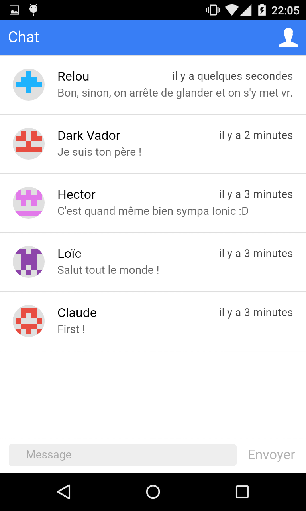

Tant qu'on est sur les petites améliorations, tu as peut être remarqué que messages sont tronqués à la fin de la première ligne. Aller, un petit coup de CSS pour régler ça ;)

### Étape 5 : Et si on supprimait des messages ?

Bonne idée ? Mauvaise idée ? En tous cas, on y va !!!

Ta tâche, si tu l'acceptes, sera maintenant de supprimer un message lorsque l'utilisateur fait un appui long dessus. Pour que ce ne soit pas innatendu par l'utilisateur, un [ActionSheet](http://ionicframework.com/docs/api/service/$ionicActionSheet/) pourrait être le bienvenu :)

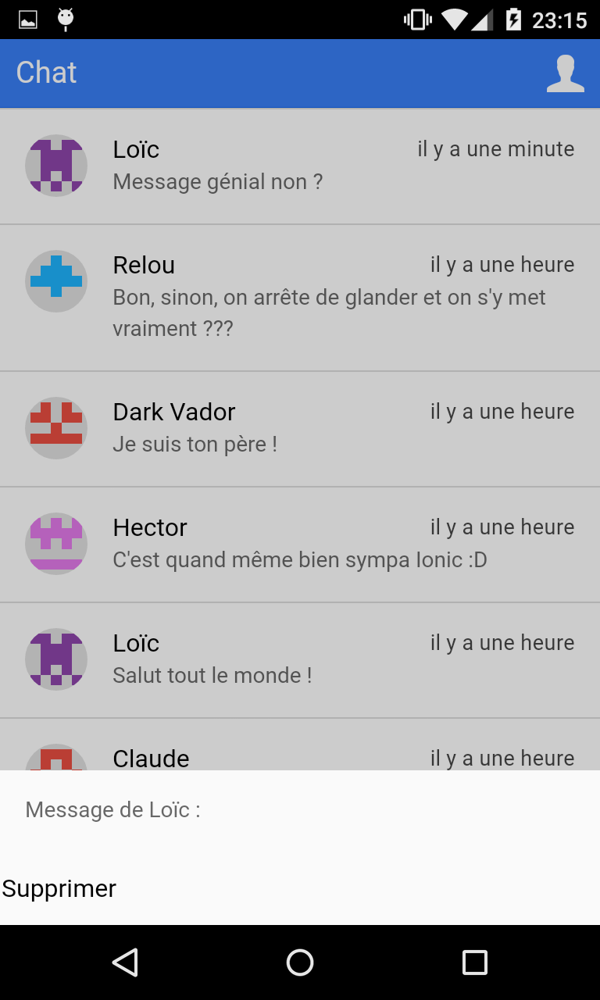

### Étape 6 : Préparation du multi-room : le side-menu

Parler tous ensemble c'est bien mais ce serait bien d'avoir des sujets précis et donc de gérer le multi-room. Dans le concept c'est très simple, au lieu de publier les messages dans `/myname/`, on va les publier dans `/myname/roomId/`. Cependant, cela va représenter pas mal de changements, notamment sur la partie interface. C'est pourquoi cette fonctionnalité est séparée en plusieurs étapes.

Commençons par mettre en place un [side-menu](http://ionicframework.com/docs/api/directive/ionSideMenus/). Pour cela il va falloir créer un état abstrait et un [état imbriqué](https://github.com/angular-ui/ui-router/wiki/Nested-States-%26-Nested-Views) à notre application et renommer l'état courant pour garder un peu de cohérence.

Résultat : 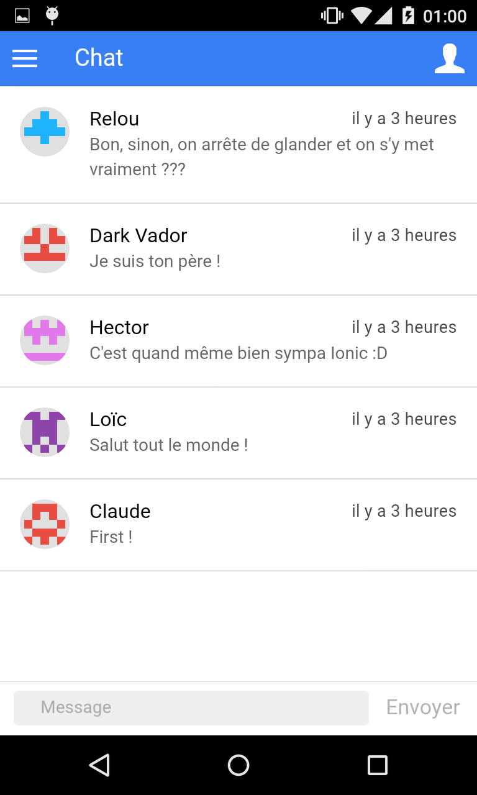 et 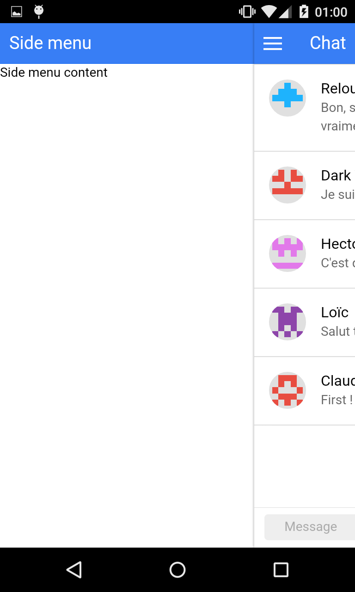

### Étape 7 : Préparation du multi-room : afficher et ajouter des rooms dans le side-menu

Tout d'abord, il faut récupérer la liste des rooms pour l'afficher dans le side-menu. Pour ce faire, tu peux regarder du côté de l'[API REST](https://www.firebase.com/docs/rest/api/#section-query-parameters) de firebase.

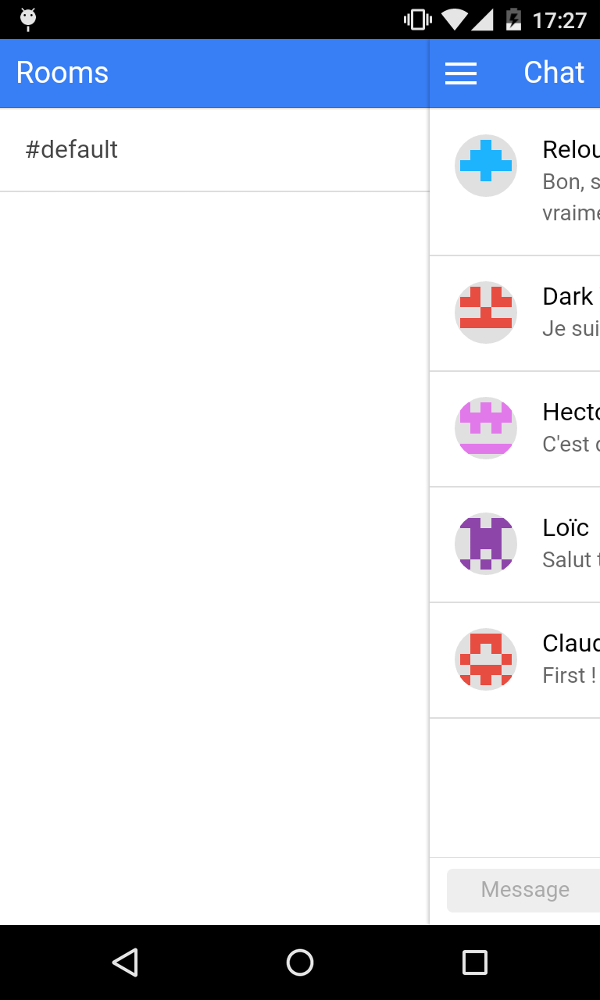

On va maintenant vouloir créer une room et afficher son contenu dans l'écran principal. Pour cela, on peut utiliser une popup dans le side-menu pour créer la nouvelle room et il faudra paramétrer notre état room pour qu'il affiche différents contenus.

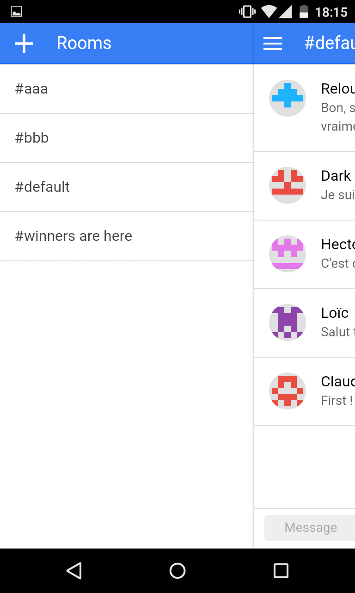 et 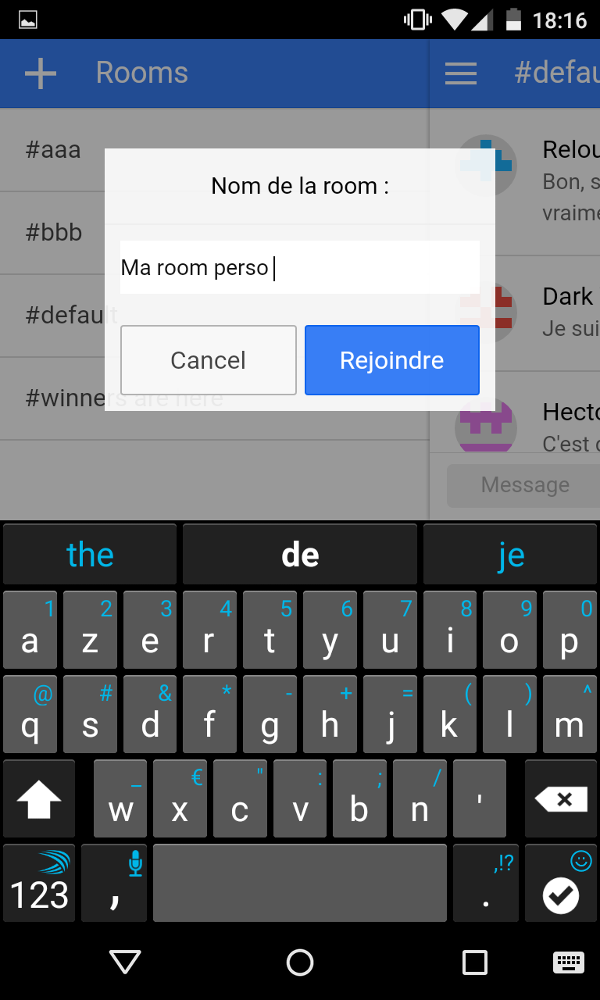

### Étape 8 : Markdown support

L'application commence à être sympa non ? Et si on y ajoutait des styles ? Genre du markdown ?

Ce qui est cool c'est qu'il y a déjà une lib Angular : [angular-markdown-directive](https://github.com/btford/angular-markdown-directive) :)

Et voilà : 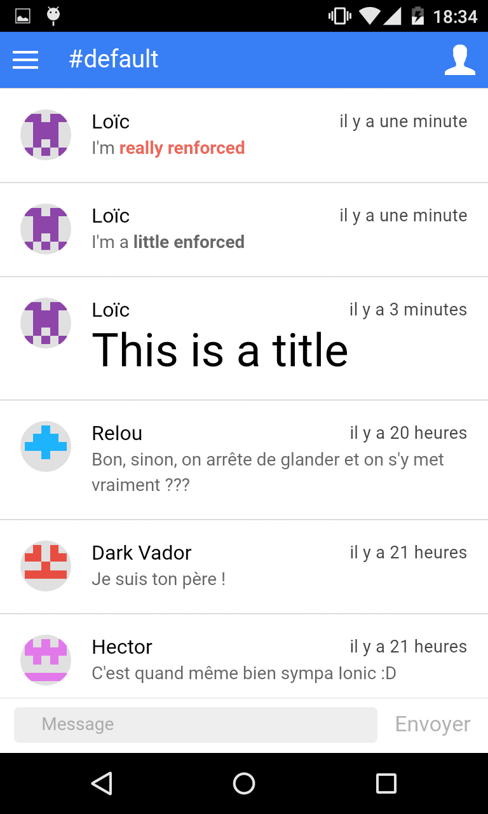

C'était simple non ?

### Étape 9 : Custom app icon

Sympa l'application non ? Faisons une petite pause dans les fonctionnalités pour s'occuper de ce qu'il y a "autour". Et notamment de l'icône et de l'image de lancement (splash screen). Ca tombe bien, Ionic nous [facilite grandement la tâche](http://ionicframework.com/docs/cli/icon-splashscreen.html) avec la CLI. Voici [un](https://www.google.fr/search?q=chat+icon&tbm=isch) [peu](https://www.google.fr/search?q=chat+bubble+icon&tbm=isch) [d'](https://www.google.fr/search?q=discussion&tbm=isch)[inspiration](https://www.google.fr/search?q=forum&tbm=isch).

Pour ceux qui sont sous Android, ne vous inquiétez pas si le logo ne change pas... Android gère mal de changement de logo d'une application. Pour voir votre nouvelle icône, il suffit de désinstaller l'application et de la réinstaller.

### Étape 10 : Add native plugins (Toast, Dialog)
