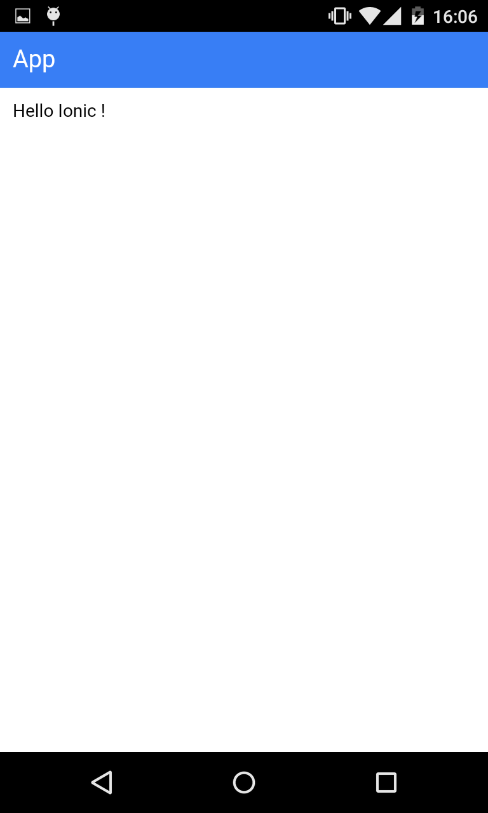
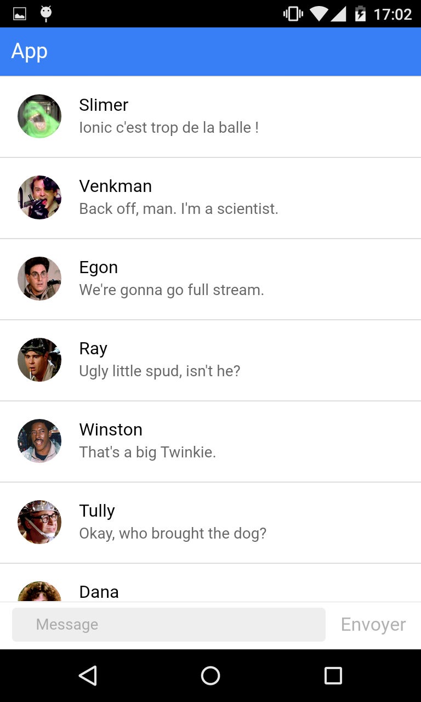

# Faire un chat avec Ionic & Firebase
##### Par [Loïc Delmaire](https://twitter.com/loicdelmaire) & [Loïc Knuchel](http://loic.knuchel.org/)

**Prérequis** : Les participants doivent connaitre un minimum de JavaScript et d'Angular pour pouvoir faire cet atelier dans les meilleures conditions

### L'application à développer

L'objectif de ce [Hands on Lab](http://cfp.devoxx.fr/2015/talk/JDN-0259/3h_pour_creer_votre_application_mobile_de_chat) est de faire coder aux participants une application mobile de chat en utilisant Ionic Framework (Cordova et Angular) et Firebase comme backend.

Les premières étapes sont la mise en place d'un MVP fonctionnel puis l'enrichissement progressif de celui-ci avec différentes fonctionnalités :

- changement de pseudo
- multi-room
- support des avatar
- support du markdown
- changer l'icone de l'application

### Informations

Ressources utiles :

- [Ionic Framework docs](http://ionicframework.com/docs/)
- [Angular API](https://docs.angularjs.org/api)

### Installation

Les participants doivent avoir installé leur environnement au préalable et exécuté le template de base de ce repo (branche master). Pour cela, le mieux est de suivre le [Getting Started](http://ionicframework.com/getting-started/) de Ionic framework puis cloner ce repo et lancer les commandes suivantes :

```
npm install
bower install
cordova platform add [android/ios]
ionic run
```

### Étape 0 : mise en place de la structure de l'application

Si tu as cloné ce repo, passe directement à l'étape 1. Si tu souhaites réellement partir de 0, cette étape te permettra d'arriver au point de départ de ce repo.

- crée un projet ionic vide (devoxx-ionic-chat)
- ajoute ta plateforme et lance l'application sur ton téléphone
- si l'application se lance, bravo !!! Tout fonctionne bien ! Sinon... :( Tu peux reprendre le [Getting Started](http://ionicframework.com/getting-started/) ou poser une question sur le [forum Ionic](http://forum.ionicframework.com/)
- ajoute `www/lib/`, `resources/android/` et `resources/ios/` dans le .gitignore
- renomme l'application angular de 'starter' en 'app'
- crée les fichiers de contrôleurs et services et inclu les dans l'index.html
- remplace le contenu du body par un unique nav view
- crée une première route, app, avec son contrôleur et sa vue. La vue comportera simplement une barre de navigation avec un titre et un contenu vierge.
- lance ton application dans le navigateur et sur ton téléphone :)

Voici le résultat que tu devrais obtenir : 

### Étape 1 : création de l'interface

Il y a deux éléments principaux dans une application de chat, la liste des messages et le champ de texte pour envoyer un nouveau message.

Commençons par la liste des messages. Tout d'abord, il va falloir prendre des données pour voir à quoi ressemblera cette liste. Voici quelques messages de test :
```javascript
[
    {user: {avatar: 'http://ionicframework.com/img/docs/venkman.jpg', name: 'Venkman'}, content: 'Back off, man. I\'m a scientist.'},
    {user: {avatar: 'http://ionicframework.com/img/docs/spengler.jpg', name: 'Egon'}, content: 'We\'re gonna go full stream.'},
    {user: {avatar: 'http://ionicframework.com/img/docs/stantz.jpg', name: 'Ray'}, content: 'Ugly little spud, isn\'t he?'},
    {user: {avatar: 'http://ionicframework.com/img/docs/winston.jpg', name: 'Winston'}, content: 'That\'s a big Twinkie.'},
    {user: {avatar: 'http://ionicframework.com/img/docs/tully.jpg', name: 'Tully'}, content: 'Okay, who brought the dog?'},
    {user: {avatar: 'http://ionicframework.com/img/docs/barrett.jpg', name: 'Dana'}, content: 'I am The Gatekeeper!'},
    {user: {avatar: 'http://ionicframework.com/img/docs/slimer.jpg', name: 'Slimer'}, content: 'Boo!'}
]
```

Tu as une super liste ? Bravo !

Maintenant nous allons pouvoir créer le champ de text pour envoyer un nouveau message et créer une fonction pour envoyer le message écrit (c'est à dire, l'ajouter à la liste des messages affichés).

Bon, ça commence à prendre forme ! Mais à y regarder d'un peu plus près, il y a quelques petits problèmes UX... Si tu veux les régler, c'est bonus !

- le message reste dans le champ de texte lorsqu'on l'envoi (il devrait disparaitre...)
- si on appuie sur Enter (sur le PC) ou sur Ok (sur le mobile), le message n'est pas envoyé

Et voilà ! Si tu s'est bien passé tu devrais avoir quelque chose comme : 
